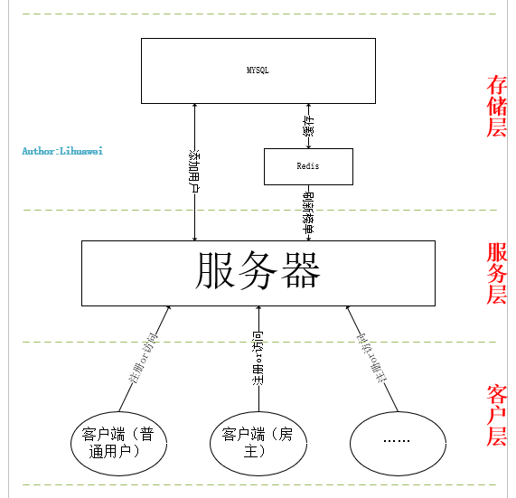

# ModernProductPlant
该项目将展示给你一个作者畅想的一个现代化生产车间,包括分布式系统管理车间的大批量生产机器(注塑机),并采用现代化机器学习方法对生产产品进行实时质量管控
由于时间原因，作者利用该网络架构搭建了一个直播系统；

## 直播系统架构

### 概述

个人认为，我通过借鉴他人架构搭建的spider网络架构并不适用于直播系统，但是作者为了对C/S有一个形象、系统的认识，依然选择用它来搭建一个直播系统。

### 客户层

在客户层，主要由房主（主播）和观众两类人，根据权限的不同，观众里还有房管和普通观众之分，他们拥有自己的权限和职责。客户层主要与服务层交互，弹幕等。

### 服务层

服务层的义务则比较多，客户端的上下线，弹幕的筛选等等。同时也是客户端与存储层交流的桥梁。

### 存储层

存储层会使用MySql存储用户的注册信息，同时由于刷礼物的榜单更新的速率非常快，使用数据库读取效率非常低，因此使用redis作为缓存。